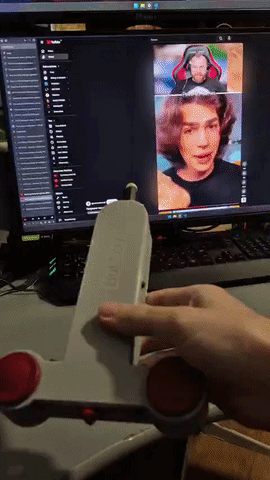
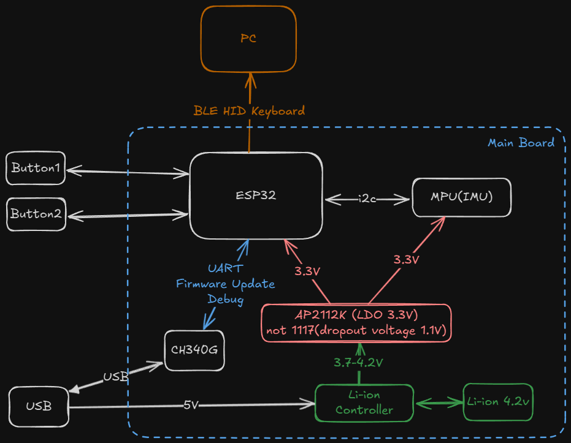
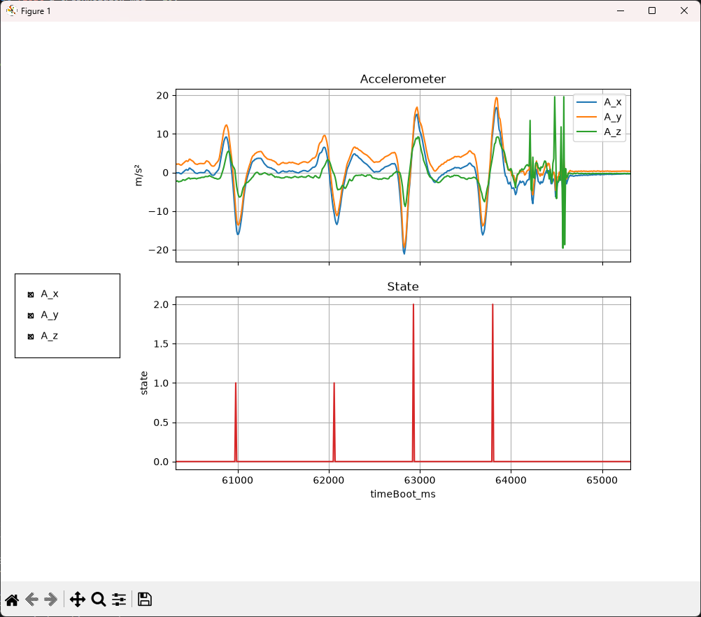
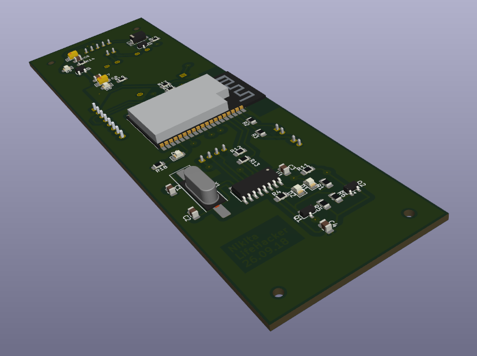
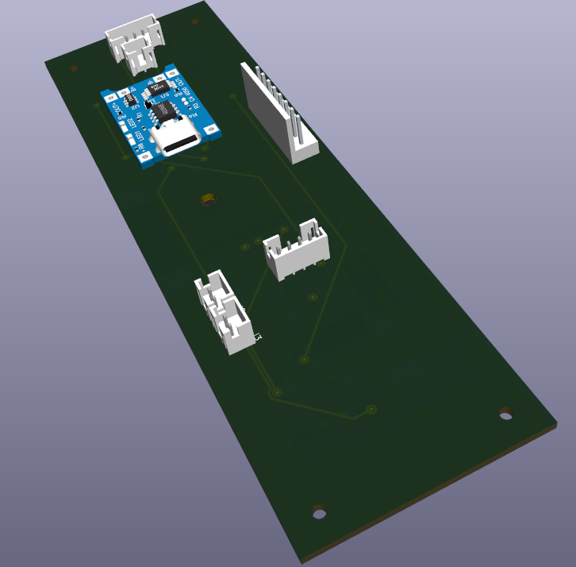
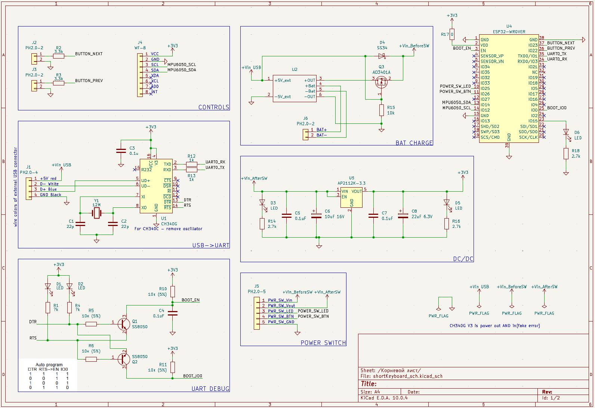

# ShortsKeyboard v1.0

## Описание

Клавиатура для переключения видео - вперед/назад посредством встряски.

* ./3dmodel/ShortsKeyboardCase.FCStd - модель корпуса, в реальности USB подуключил сзади, спереди кнопка включения
* ./3dmodel/TumblerPowerOn.FCStd - кнопка включения (in process)
* ./shortKeyboard_sch/ - принципиальная схема + печатная плата основного модуля
* ./powerSwitch_sch/ - печатная плата кнопки включения - не влезла в корпус (tbd)

## Блок-схема

## График ускорения при встряске

